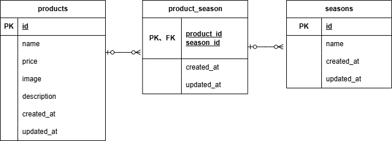

# mogitate（商品管理アプリ）

## アプリ概要
商品を登録・一覧表示・検索できるシンプルな商品管理アプリです。  
画像付きで商品情報を管理することができます。

---

## 環境構築

### Dockerビルド
```bash
git clone https://github.com/rararamonkey/test_mogitate.git
cd test_mogitate
docker-compose up -d --build
```

※ Mac（M1・M2）の場合  
エラーが出る場合は docker-compose.yml に以下を追記してください

```yml
mysql:
  platform: linux/x86_64
  image: mysql:8.0.26
```

---

### Laravel環境構築

```bash
docker-compose exec php bash
composer install
cp .env.example .env
```

---

### .env設定

.envファイルに以下を設定してください

```
DB_CONNECTION=mysql
DB_HOST=mysql
DB_PORT=3306
DB_DATABASE=laravel_db
DB_USERNAME=laravel_user
DB_PASSWORD=laravel_pass
```

---

### アプリケーションキー生成

```bash
php artisan key:generate
```

---

### データベース構築（テーブル作成＋初期データ）

```bash
php artisan migrate --seed
```

※ 上記コマンド実行後、商品データが自動で登録されます

---

### ストレージリンク作成（画像表示用）

```bash
php artisan storage:link
```

## テスト用画像の準備

本アプリでは商品画像をGitで管理していません。

以下の手順でテスト用画像を配置してください。

1. 提供された `fruits-img.zip` をダウンロード
2. 解凍する
3. `storage/app/public/products/` に配置する

※ 画像が表示されない場合は `php artisan storage:link` を再実行してください

---

## 使用技術（実行環境）

- PHP 8.x
- Laravel 8.x
- MySQL 8.x
- Docker

---

## 機能一覧

- 商品一覧表示
- 商品検索機能（キーワード検索）
- 商品並び替え（価格順）
- 商品詳細表示
- 商品登録機能
- 商品更新機能
- 商品削除機能
- 画像アップロード・表示

---

## ER図



---

## URL

- 開発環境：http://localhost/
- phpMyAdmin：http://localhost:8080/

---

## 補足

画像は以下のディレクトリに保存されています

```
storage/app/public/products/
```

表示には以下を使用しています

```blade
image) }}">
```
